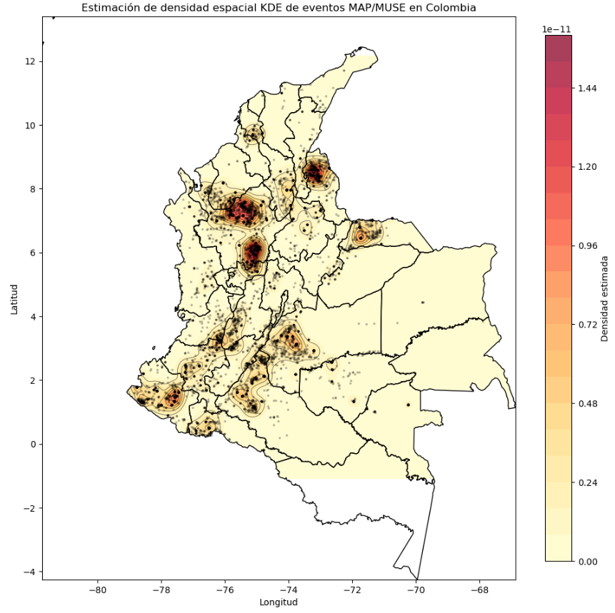
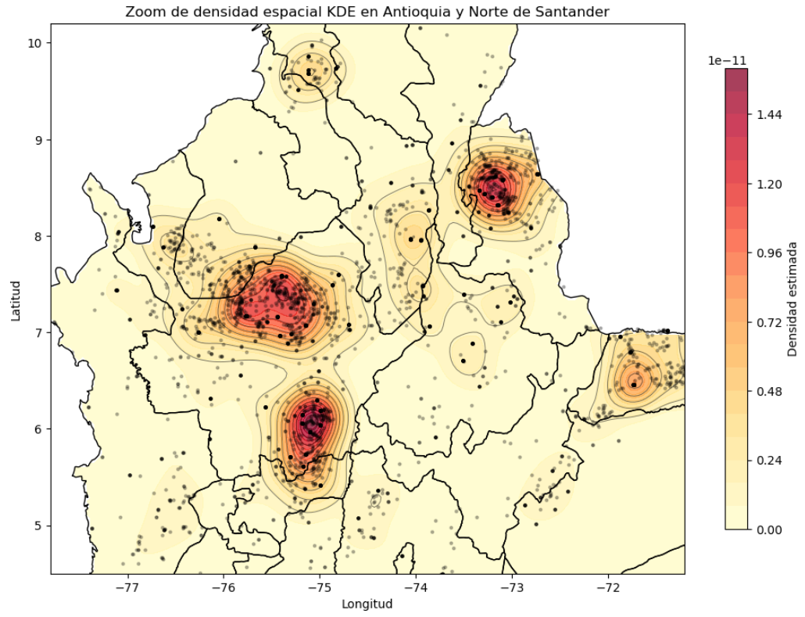
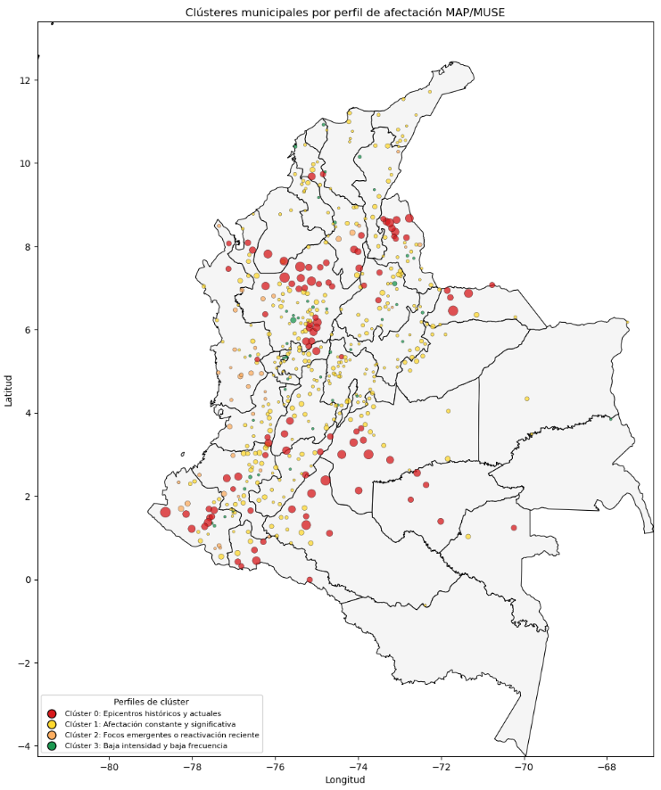
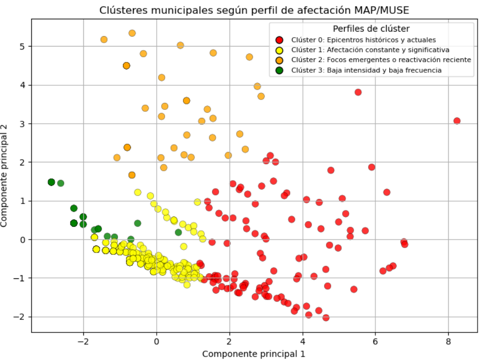

# Proyecto de priorización territorial MAP/MUSE

## Análisis espacial y territorial de accidentes por MAP/MUSE en Colombia

Este proyecto analiza la distribución espacial y territorial de accidentes por **Minas Antipersonal (MAP)** y **Municiones sin Explosionar (MUSE)** en Colombia, usando técnicas de análisis exploratorio, estimación de densidad espacial, reducción de dimensionalidad, agrupamiento no supervisado y clasificación supervisada.

El objetivo principal es identificar patrones de afectación y construir una lectura de priorización municipal basada en variables históricas, recientes y territoriales.

---

## Objetivo del proyecto

Caracterizar los accidentes por MAP/MUSE en Colombia e identificar municipios con perfiles similares de afectación, mediante técnicas de ciencia de datos y análisis espacial.

---

## Métodos utilizados

El proyecto integra los siguientes métodos:

- **Análisis exploratorio de datos**
- **Estimación de densidad espacial KDE**
- **Reducción de dimensionalidad con PCA**
- **Clustering municipal con K-means**
- **Clustering espacial complementario con DBSCAN**
- **Clasificación supervisada con Random Forest**
- **Explicabilidad del modelo con SHAP**

---

## Estructura general del análisis

1. **Carga y limpieza de datos**
   - Lectura de la base de eventos MAP/MUSE.
   - Revisión de valores faltantes, duplicados y variables principales.

2. **Análisis descriptivo**
   - Distribución por tipo de evento.
   - Evolución temporal.
   - Departamentos y municipios con mayor número de accidentes.
   - Análisis por tipo de área.

3. **Análisis espacial**
   - Visualización de puntos georreferenciados.
   - Estimación de densidad espacial mediante KDE.
   - Identificación de zonas de mayor concentración.

4. **Clustering municipal**
   - Construcción de variables agregadas por municipio.
   - Normalización de variables.
   - Aplicación de PCA.
   - Agrupamiento con K-means.

5. **Clasificación supervisada**
   - Uso de Random Forest para interpretar los clústeres generados.
   - Evaluación mediante métricas de clasificación.
   - Análisis de importancia de variables.

---

## Tipología de clústeres

| Clúster | Color | Perfil territorial | Interpretación |
|---|---|---|---|
| Clúster 0 | Rojo | Epicentros históricos y actuales | Municipios con alta afectación histórica, persistencia temporal y ruralidad elevada. |
| Clúster 1 | Amarillo | Afectación constante y significativa | Municipios con presencia sostenida de eventos, aunque sin alcanzar los niveles de los epicentros. |
| Clúster 2 | Naranja | Focos emergentes o de reactivación reciente | Municipios con mayor proporción de eventos recientes frente a su acumulado histórico. |
| Clúster 3 | Verde | Baja intensidad y baja frecuencia | Municipios con eventos aislados o de baja recurrencia. |

---

## Visualizaciones principales

### Densidad espacial KDE de eventos MAP/MUSE



### Zoom territorial de zonas de mayor afectación



### Clústeres municipales por perfil de afectación



### Clústeres en el espacio PCA



---

## Mapa interactivo

El proyecto también incluye un mapa interactivo desarrollado con `Folium`, que permite acercar, alejar y consultar información municipal por punto.

Archivo sugerido:

```text
mapa_interactivo_clusters_MAP_MUSE.html
